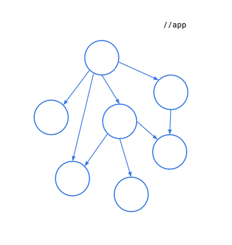

# Hybrid build

Hybrid builds were implemented in response to dealing with large module graphs in a project and not all of them would be migratable or requires much refactoring effort to make them build with both the build systems. Hybrid builds helps in performing incremental migrations on large projects where one shot migration might not possible.

It works in tandem with [Migration Criteria](migration_criteria.md) and builds only part of the dependency graph with Bazel and ensures remaining graph nodes are built with Gradle while consuming artifacts built by Gradle.

<p align="center">

</p>

## How it works

During Gradle's configuration phase, Grazel does `bazelisk build //...` on the project directory to build all targets. This action would generate build artifacts like `.jar` or `.aar` in the configuration phase. Then Grazel sets up dependency substitution rules on the entire dependency graph such that during resolution if Grazel finds an build artifact for a project, it removes the `project` dependency and replaces it with the built artifact. 

Doing this process on the entire graph lets the execution phase use prebuilt artifacts by Bazel in the part of the graph and rest with Gradle.

<p align="center">

</p>

## Run Hybrid builds

Hybrid builds can be triggered by settting `bazelEnabled` boolean property in either `local.properties` or `gradle.properties`. Then when building any gradle module like `app:assembleDebug`, Grazel would build and register substitution rules. Substitution rules occur lazily and only when `configuration` it is replacing dependency of is needed in current build.

## Debugging

To perform dependency substitution, Grazel relies on strong naming conventions. If there is a module called `:quiz`, then the corresponding artifact that would be searched for would be `quiz.aar` and `quiz.jar`. 

During build to debug whether substituions are happening correctly look for `Dependency Substitution` table in build logs as shown below.

```
┌───────────────────────────────────────────────────┐
│                       :app                        │
├──────────────┬─────────────┬──────────────────────┤
│Configuration │   Project   │Substitution Artifacts│
├──────────────┼─────────────┼──────────────────────┤
│implementation│:quiz        │[quiz.aar]            │
├──────────────┼─────────────┼──────────────────────┤
│implementation│:base        │[base.aar]            │
└──────────────┴─────────────┴──────────────────────┘
```

!!! error
    Note that when a build artifact for a module can't be found, Grazel fails the build. This is to ensure every module that has `BUILD.bazel` is able to build successfully 
