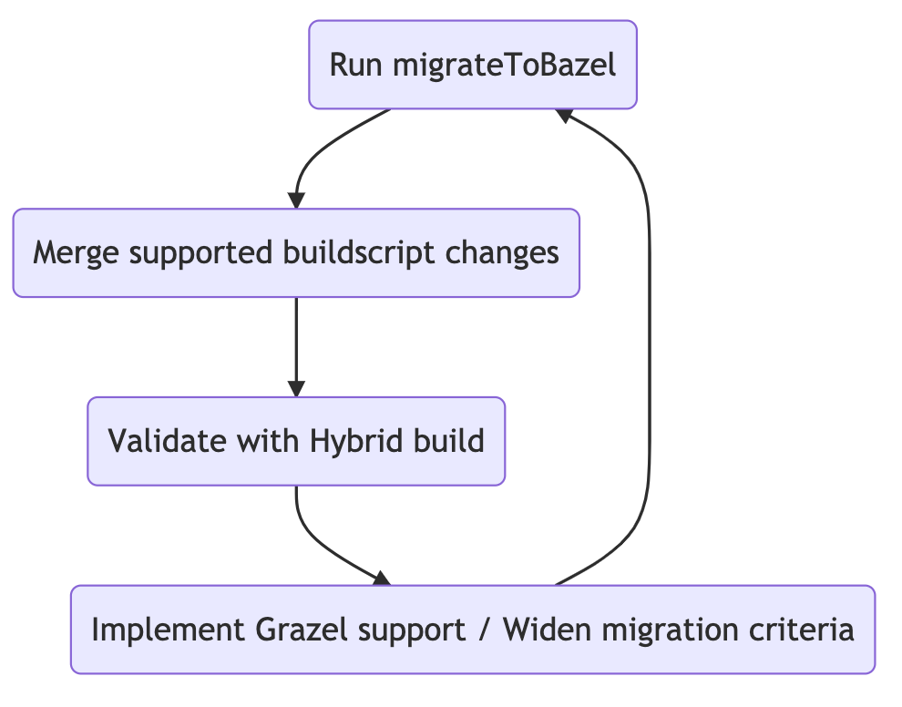

# Migration Criteria

Grazel was designed acknowledging the fact that migrating all possible combinations of Gradle project might be a difficult problem to solve. Instead it operates by knowing its own limitations on what can and cannot be migrated to Bazel. It does this by establishing various `MigrationCriteria`. 

Every module is run through set of predefined `MigrationCriteria` and is checked for compatibility. Only modules that pass the criteria are selected for migration, and then induced subgraphs of those modules are migrated to bazel i.e generate bazel scripts.

## Criteria

### Sample Criteria

Let's consider a sample crtierion that a module should be Android, Kotlin or Java project to be eligible for migration.

```kotlin
@Singleton
internal class PluginsMigrationCriteria 
@Inject 
constructor() : MigrationCriteria {
    override fun canMigrate(project: Project): Boolean {
        return project.isAndroid || project.isJava || project.isKotlin
    }
}
```

This criteria is evaluated together with other criteria and then final graph for migration is calculated. This approach enables Grazel to do [incremental migrations](#incremental-migration).

### Predefined criteria

* Android, Java or Kotlin plugin is applied to the module
* A module's dependencies are all resolved from supported Maven repositories. [Details](migration_capabilities.md#maven-artifact-repositories).

!!! note
    The pre-existing criteria were designed keeping Grab's app in mind. It might need to be expanded depending on project configuration. If you encounter such issues, please let us know.

### User defined criteria

Few migration critera are configurable via Grazel extensions.

* Databinding - Android project using databinding/viewbinding are not migrated by default. The [android extension](grazel_extension.md#databinding) can be used to change that.
* Ignored artifacts - A module that uses any of the artifacts that ignored in dependencies extension are not migrated. 

### Contribute custom criteria

A module passing migration criterria means that it can be safely built with Bazel. Due to missing checks it is possible a module was migrated but build fails. In that case the migration criteria needs to be updated or a new check needs to be added to prevent build failures. To do that, start by implementing `MigrationCriteria` interface.

```kotlin
@Singleton
internal class CustomMigrationCriteria 
@Inject 
constructor() : MigrationCriteria {
    override fun canMigrate(project: Project): Boolean {
        return // Custom checks
    }
}
```

Add the criteria to [set](https://github.com/grab/Grazel/blob/2394bb8269f7c49ec05fa7bd12b8b9a10585aadb/grazel-gradle-plugin/src/main/kotlin/com/grab/grazel/gradle/MigrationCriteria.kt#L37) to let Grazel pick up the condition.

```kotlin
@ElementsIntoSet
@Provides
fun migrationCriteria(
    //...
    customMigrationCriteria: CustomMigrationCriteria
): Set<MigrationCriteria> = setOf(
    //...
    customMigrationCriteria
)
```

## Incremental Migration

Through use of migration criteria, Grazel can do incremental migrations where initially supported modules can be migrated. Then by increasing Grazel's feature set or by custom rules, the migration criteria can be widened to cover more modules.

For validations on these partial migrations, Grazel can also setup [hybrid builds](hybrid_builds.md) to assert these changes.

## Forward Compatible

Validating against migration crtieria helps in letting changes generated by Grazel to be forward compatible. This means since Gradle is always source of truth for the duration of migration, any feature changes changes in Gradle can be synced with Bazel simply by running `migrateToBazel`. This is particularly helpful in earlier stages of migration where not a lot of modules could be migrated and feature development was causing lot of graph changes.

## Migration Workflow

Migration workflow with Grazel could look like below.



This way 100% compatible build can be acheived while having defined results along the way.

